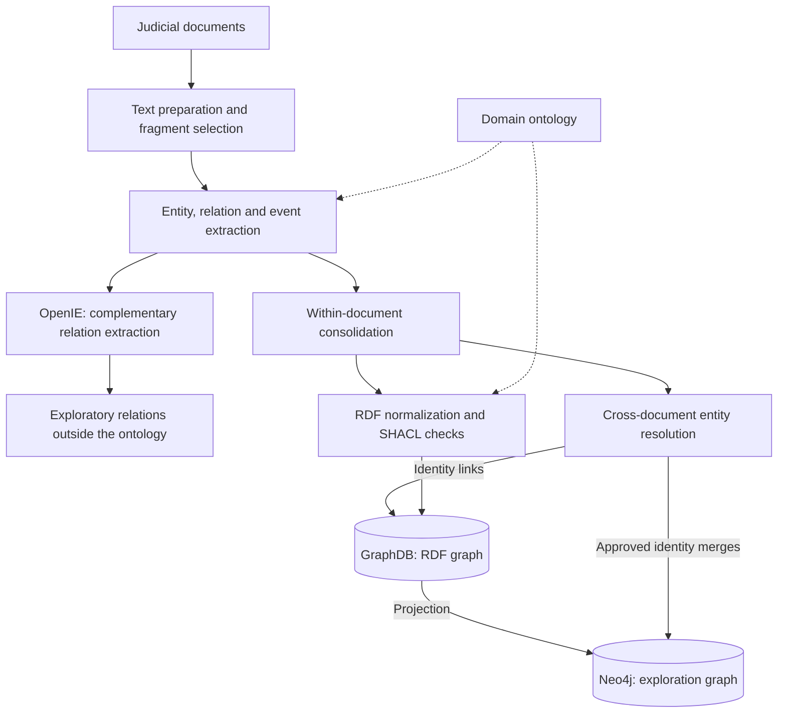
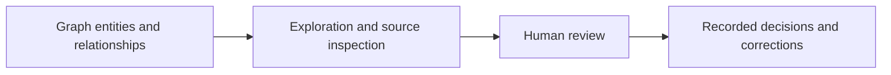

# Nexo-Memoria

Nexo-Memoria is a collaborative knowledge-graph project supporting Abuelas de Plaza de Mayo. It connects people, places, organizations and events described in judicial documents, with source references and tools for historical research.

Researchers can explore those connections as a network, table or map, investigate them with an agent, and review entities and relationships in the graph.

[How it works](https://nexo-memoria.abuelas.org.ar/como-funciona) · [IA por la Identidad](https://iaporlaidentidad.org)

## Building the graph

Documents are converted into text with page and section context. Relevant fragments pass through ontology-guided extraction: entities first, followed by relations and events. Consolidation resolves references and duplicate mentions within each document.

Graph construction and cross-document identity resolution have distinct roles. RDF normalization represents extracted information in the domain model, including temporal and geographic information. Cross-document resolution links mentions of the same entity using similarity rules, contextual LLM judgments and a persistent alias registry.

SHACL checks structural constraints; it does not establish whether a statement is historically true. A complementary OpenIE pass captures relations outside the formal vocabulary for further analysis.

Provenance accompanies the extracted information: document and fragment references connect graph assertions to their source material. It is separate from the record of human review decisions.

## Reviewing the graph

Human review starts from the graph: researchers inspect entities and relationships, consult evidence, and propose corrections, identity merges or relationship changes.

Annotations, review decisions and implementation status are tracked separately. Approved corrections retain their authorship and rationale, so accepting a proposal and applying its change remain distinguishable.

## Investigating with an agent

The research agent queries the graph, inspects entities and follows connections. It brings results into the shared exploration workspace and can switch between network, table and map views, focus on a place or set a time window.

An MCP interface exposes research tools to compatible external agents.

## Exploring places and time

The map presents places, associated events and transfers within the same exploration workspace. Time-window filtering supports investigation across periods, while linked entity details connect the geographic view to the rest of the graph.

Location precision remains visible: exact coordinates and approximate administrative locations are distinguished. Temporal expressions are represented as intervals, preserving imprecision rather than forcing every event onto a single date.

[Spanish Temporal Intervals](https://github.com/rubin145/spanish-temporal-intervals) develops the temporal parser as an independent library, turning expressions such as “fines de 1976” into date intervals.
